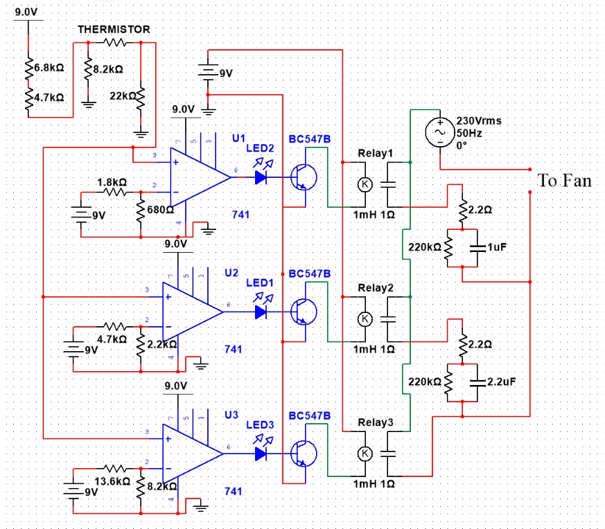

# Automatic Fan Speed Controller Project

Welcome to ny project on **Automatic Fan Speed Controller**. This project demonstrates a system that adjusts fan speed based on temperature changes using a thermistor, an op-amp (IC741), a relay switch, and an AC voltage capacitor. This setup ensures efficient cooling tailored to environmental conditions.

## Project Overview

The primary objective of this project is to utilize a thermistor for accurate temperature measurement, which then influences the speed of a fan through a control circuit. This setup mimics real-world applications where automatic temperature regulation is crucial for maintaining comfort and efficiency.

## Circuit Diagram

The following is the circuit diagram for the project:

## Key Components Used

- **Thermistor**: Measures temperature accurately.
- **Op-amp (IC741)**: Processes the temperature data and drives the control circuit.
- **Relay Switch**: Controls the fan speed based on temperature readings.
- **AC Voltage Capacitor**: Ensures stable operation of the control circuit.

## Features

- **Temperature-Based Fan Speed Control**: Fan speed adjusts dynamically in response to temperature changes, optimizing cooling efficiency.
- **Energy Efficiency**: Reduces power consumption by adjusting fan speed based on actual cooling needs.
- **Reliable Operation**: Integrated relay switch ensures reliable performance of the fan control mechanism.

## Achievements

- **Effective Temperature Sensing**: Utilized thermistor for precise temperature measurement.
- **Practical Implementation**: Demonstrated a functional automatic fan speed control system.
- **Demonstration Video**: [Watch our project in action](https://drive.google.com/file/d/156V3i_2Y7_KmLLYiVFdqQFL7fI4UX5Mt/view?usp=drive_link) (Note: A 100 W bulb was used in place of the fan for demonstration purposes).

## How to Use

To replicate or utilize our project:
1. **Circuit Assembly**: Connect the components (thermistor, op-amp, relay switch, AC voltage capacitor) as per the provided circuit diagram.
2. **Power Supply**: Ensure the circuit is powered correctly.
3. **Temperature Measurement**: Position the thermistor in the environment where temperature monitoring is required.
4. **Operation**: Observe how the fan speed adjusts based on temperature variations.

## License

You can use this project for study purposes but not for business purposes. If you want to use it for business purposes, please take permission from the author otherwise Legal action will be taken.

Contact: divyeshkapadiya25@gmail.com

---

Feel free to reach out to us for any inquiries or feedback regarding our project. We hope our work inspires advancements in temperature-based control systems!